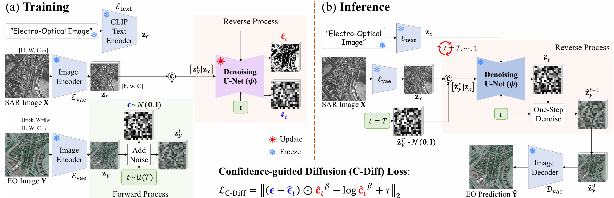

# C-DiffSET: Leveraging Latent Diffusion for SAR-to-EO Image Translation with Confidence-Guided Reliable Object Generation

Official PyTorch implementation of the paper **"C-DiffSET: Leveraging Latent Diffusion for SAR-to-EO Image Translation with Confidence-Guided Reliable Object Generation"**, accepted to **IEEE Transactions on Circuits and Systems for Video Technology (TCSVT), 2026**.

[Jeonghyeok Do](https://sites.google.com/view/jeonghyeokdo/)<sup>1</sup>, [Jaehyup Lee](https://sites.google.com/view/jaehyup-lee/)<sup>2</sup>, [Seungchul Lee](https://stellarvision.co.kr/)<sup>3</sup>, and [Munchurl Kim](https://ee.kaist.ac.kr/en/professor/12143/)<sup>1,&dagger;</sup>

<sup>1</sup> School of Electrical Engineering, KAIST, Daejeon, Korea &nbsp;&nbsp; <sup>2</sup> School of Computer Science and Engineering, Kyungpook National University, Daegu, Korea &nbsp;&nbsp; <sup>3</sup> Stellarvision Inc., Daejeon, Korea

<sup>&dagger;</sup> Corresponding author

[](https://doi.org/10.1109/TCSVT.2026.3701447)
[](https://arxiv.org/abs/2411.10788)
[](https://kaist-viclab.github.io/C-DiffSET_site/)

---

## 📰 News

- **Sep 1, 2026:** Check our new work [ReFlowSET](https://github.com/KAIST-VICLab/ReFlowSET), a representation-aligned latent flow-matching framework for SAR-to-EO image translation with code & checkpoints for all benchmarked methods fully released! ❤️
- **Jul 1, 2026:** Code are released. 🎉
- **Jun 1, 2026:** C-DiffSET is accepted to IEEE TCSVT. 🎉
- **Dec 9, 2024:** This repository is created.

---

## Overview

SAR imagery works in all weather and lighting conditions but is hard to interpret because of speckle noise and its unusual structure. **C-DiffSET** translates SAR into EO (electro-optical) imagery by **fine-tuning a pretrained Latent Diffusion Model (Stable Diffusion v2.1)** rather than training from scratch, which mitigates overfitting on the small paired SAR–EO datasets.

Two ideas make this work:

1. **Shared latent space via a frozen VAE.** SAR and EO images are embedded by the *same* pretrained VAE encoder. The SAR latent is concatenated (channel-wise) with the noisy EO latent and used to condition the denoising U-Net, which preserves pixel-wise correspondence.
2. **Confidence-guided diffusion (C-Diff) loss.** The U-Net additionally predicts a per-pixel variance. A β-NLL–style loss down-weights uncertain regions, so temporal discrepancies (objects that appear/disappear between the SAR and EO acquisitions) are not aggressively hallucinated.

C-DiffSET reaches state-of-the-art results on **QXS-SAROPT, SAR2Opt, SpaceNet6**, and a proprietary **Stellar-Vision** dataset.

<p align="center">
  
  <br>
  <em>Overview of the proposed C-DiffSET framework. (a) <b>Training</b>: a frozen VAE encodes the SAR image <b>X</b> and EO image <b>Y</b> into a shared latent space; noise is added to the EO latent in the forward process, and the denoising U-Net predicts both the noise &epsilon;&#770;<sub>t</sub> and a confidence map <b>c</b>&#770;<sub>t</sub> conditioned on the SAR latent <b>z</b><sub>x</sub>, optimized by the C-Diff loss. (b) <b>Inference</b>: an EO image <b>Y</b>&#770; is generated from a SAR input by iteratively denoising a random latent <b>z</b>&#770;<sub>y</sub><sup>T</sup>.</em>
</p>

---

## Architecture in a nutshell

The pretrained SD 2.1 U-Net is modified in two places (`train.py`):

| Layer | Original | Modified | Purpose |
|-------|----------|----------|---------|
| `conv_in`  | 4 ch  | **8 ch** | concat `[SAR latent \| noisy EO latent]`; original weights duplicated and scaled by 0.5 |
| `conv_out` | 4 ch  | **5 ch** | 4 channels for predicted noise + 1 channel for raw variance (zero-initialized) |

The VAE and CLIP text encoder are **frozen**; only the U-Net is fine-tuned. Following the paper, a fixed prompt (`"electro-optical image"`) is used as a semantic anchor at both training and inference time, instead of a null/empty prompt.

---

## Installation

```bash
git clone https://github.com/KAIST-VICLab/C-DiffSET.git
cd C-DiffSET

conda create -n cdiffset python=3.10 -y
conda activate cdiffset

# Install PyTorch matching your CUDA version first (see https://pytorch.org),
# then the remaining dependencies:
pip install -r requirements.txt
```

> Please install the `torch` / `torchvision` build that matches your CUDA setup. The other packages are version-flexible; `diffusers` must be recent enough to expose `register_to_config`.

**Base model.** The pretrained backbone is loaded from [`Manojb/stable-diffusion-2-1-base`](https://huggingface.co/Manojb/stable-diffusion-2-1-base) on the Hugging Face Hub (the original `stabilityai/stable-diffusion-2-1-base` repository is no longer available). It is downloaded automatically on first run. To use a different backbone, override `pretrained_model_name_or_path` in the config or via `--pretrained-model-name-or-path`.

---

## Data preparation

### 1. Download the datasets

| Dataset | Pol. | GSD | Link |
|---------|------|-----|------|
| QXS-SAROPT | single | 1 m | https://github.com/yaoxu008/QXS-SAROPT |
| SAR2Opt | single | 1 m | https://github.com/MarsZhaoYT/SAR2Opt-Heterogeneous-Dataset |
| SpaceNet6 | full | 0.5 m | https://spacenet.ai/sn6-challenge/ |
| Stellar-Vision | single | 0.5–1.2 m | proprietary (not publicly released) |

### 2. Generate the split lists

`data/data_split.py` writes `train_eo_list*.txt/.pkl` and `test_eo_list*.txt/.pkl` under `./data/<Dataset>_split/`, which is exactly where the configs look for them:

```bash
python data/data_split.py --dataset spacenet --dataroot /path/to/SpaceNet6 --ratio 80
python data/data_split.py --dataset saropt   --dataroot /path/to/sar2opt
python data/data_split.py --dataset qxs      --dataroot /path/to/QXSLAB_SAROPT --ratio 80
```

The feeders derive the SAR path from the EO path automatically (e.g. `PS-RGB → SAR-Intensity` for SpaceNet6, `trainB → trainA` for SAR2Opt), so only the EO list is stored.

### 3. Point the configs at your data

Edit the `dataroot` and `accelerator_path` fields in `configs/*.yaml` (they currently contain `/path/to/...` placeholders).

---

## Pretrained models

`accelerator_path` in each config should point to a **SAR-conditioned U-Net** checkpoint (8-in / 4-out, i.e. C-DiffSET *without* the confidence channel). Training then adds the 5th variance channel on top of it.

---

## Training

```bash
# SpaceNet6
python main.py --config configs/spacenet_eps_conf.yaml

# SAR2Opt
python main.py --config configs/saropt_eps_conf.yaml

# QXS-SAROPT
python main.py --config configs/qxs_eps_conf.yaml
```

Any argument in `main.py` can be overridden either through the YAML file or on the command line. Logs, checkpoints, and validation result grids are written to `work_dir`. Default settings follow the paper: AdamW, `lr = 3e-5`, weight decay `0.01`, cosine schedule, 50,000 iterations, 100-step warmup.

---

## Inference

Translate a folder of SAR `.png` images with a fine-tuned checkpoint:

```bash
python test.py \
    --sar-dir     /path/to/test/SAR \
    --output-dir  ./results/eo \
    --conf-dir    ./results/confidence \
    --checkpoint  /path/to/model.safetensors \
    --num-inference-steps 50
```

`--conf-dir` is optional; when set, the confidence map captured at the midpoint denoising step (`t = T/2`) is min-max normalized and saved alongside each EO output. Inference uses a DDIM scheduler; **50 steps** is the quality/speed sweet spot reported in the paper (~3.4 s per 512×512 image on an A6000).

---

## Evaluation metrics

`utils.py` implements the reported metrics via `torchmetrics`, `lpips`, and `pytorch-fid`: **FID, LPIPS, SCC, SSIM, PSNR** (and Inception Score for large batches). Validation during training reports PSNR and keeps the best checkpoint.

---

## Results

### SAR2Opt & SpaceNet6 (Table I)

| Type | Method | FID↓ (SAR2Opt / SpaceNet6) | LPIPS↓ | SSIM↑ | PSNR↑ |
|------|--------|:---:|:---:|:---:|:---:|
| GAN | Pix2Pix | 196.87 / 124.55 | 0.426 / 0.256 | 0.216 / 0.522 | 15.42 / 19.36 |
| GAN | CycleGAN | 139.72 / 114.81 | 0.425 / 0.274 | 0.224 / 0.493 | 14.93 / 17.80 |
| GAN | StegoGAN | 144.54 / 75.12 | 0.398 / 0.244 | 0.237 / 0.516 | 15.62 / 18.96 |
| GAN | MT-GAN | 135.42 / 72.35 | 0.385 / 0.238 | 0.252 / 0.528 | 15.82 / 19.15 |
| DDPM | SF-Diff | 91.05 / 66.12 | 0.416 / 0.258 | 0.272 / 0.249 | 16.35 / 18.85 |
| LDM | BBDM | 94.72 / 81.86 | 0.473 / 0.302 | 0.234 / 0.217 | 15.13 / 17.68 |
| LDM | cBBDM | 97.64 / 72.77 | 0.394 / 0.243 | 0.285 / 0.254 | 16.59 / 19.03 |
| **LDM** | **C-DiffSET (Ours)** | **77.81 / 37.44** | **0.346 / 0.142** | **0.286 / 0.567** | **16.61 / 21.02** |

### QXS-SAROPT (Table II)

| Method | FID↓ | LPIPS↓ | SCC↑ | SSIM↑ | PSNR↑ |
|--------|:---:|:---:|:---:|:---:|:---:|
| MT-GAN | 73.15 | 0.378 | 0.0021 | 0.295 | 15.98 |
| SF-Diff | 64.18 | 0.432 | 0.0021 | 0.299 | 16.11 |
| cBBDM | 69.47 | 0.420 | 0.0023 | 0.304 | 16.25 |
| **C-DiffSET (Ours)** | **18.15** | **0.293** | **0.0108** | **0.372** | **18.08** |

See the [paper](https://doi.org/10.1109/TCSVT.2026.3701447) and the [project page](https://kaist-viclab.github.io/C-DiffSET_site/) for the full comparison, the Stellar-Vision geo-disjoint evaluation, and all ablations (β, channel-mapping, text prompt, backbone).

---

## Repository structure

```
C-DiffSET/
├── main.py                 # entry point (YAML + argparse)
├── train.py                # Trainer: model setup, C-Diff loss, train/val loops
├── test.py                 # standalone inference
├── utils.py                # metrics + logging/reporting
├── feeders/
│   ├── __init__.py
│   └── feeder.py           # dataset classes (QXS, SAR2Opt, SpaceNet6, SEN1-2, Stellar)
├── data/
│   └── data_split.py       # train/test split generator
├── configs/
│   ├── qxs_eps_conf.yaml
│   ├── saropt_eps_conf.yaml
│   └── spacenet_eps_conf.yaml
├── assets/                 # figures for the README
├── requirements.txt
├── LICENSE
└── README.md
```

---

## Citation

If you find this work useful, please cite:

```bibtex
@article{do2026cdiffset,
  title   = {C-DiffSET: Leveraging Latent Diffusion for SAR-to-EO Image Translation with Confidence-Guided Reliable Object Generation},
  author  = {Do, Jeonghyeok and Lee, Jaehyup and Lee, Seungchul and Kim, Munchurl},
  journal = {IEEE Transactions on Circuits and Systems for Video Technology},
  year    = {2026},
  doi     = {10.1109/TCSVT.2026.3701447}
}
```

---

## Acknowledgements

This work builds on [Stable Diffusion](https://github.com/CompVis/stable-diffusion) and the Hugging Face [Diffusers](https://github.com/huggingface/diffusers) library. The C-Diff loss is inspired by the β-NLL formulation of Seitzer et al. We thank the authors of the QXS-SAROPT, SAR2Opt, and SpaceNet6 datasets.

This work was supported by the National Research Foundation of Korea (NRF) grant funded by the Korean Government (MSIT) (RS-2024-00338513).

## License

Released under the [MIT License](LICENSE). Note that the Stellar-Vision dataset is proprietary and is **not** included in this release.
